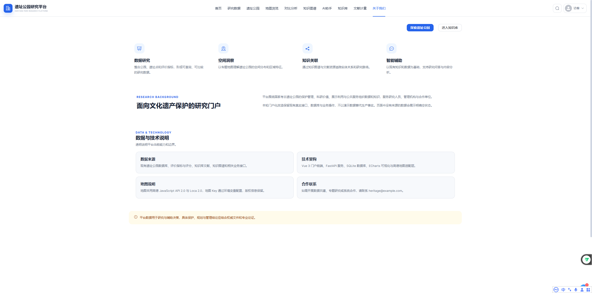
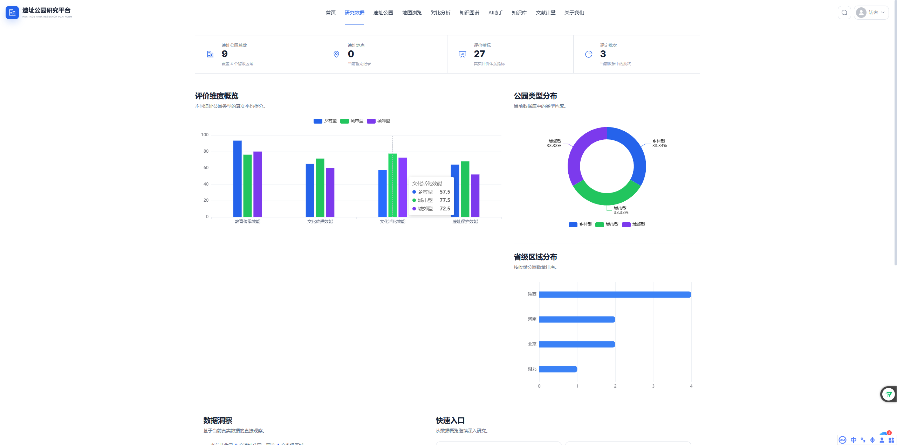
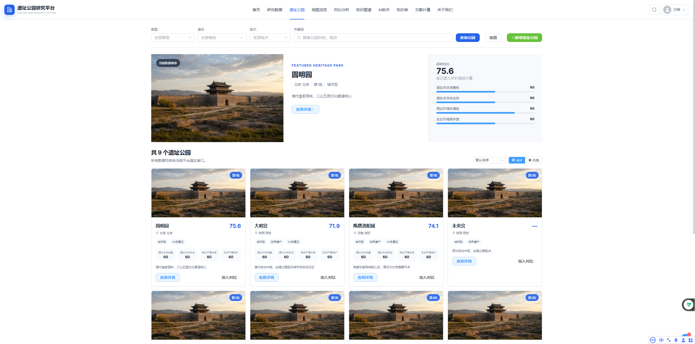
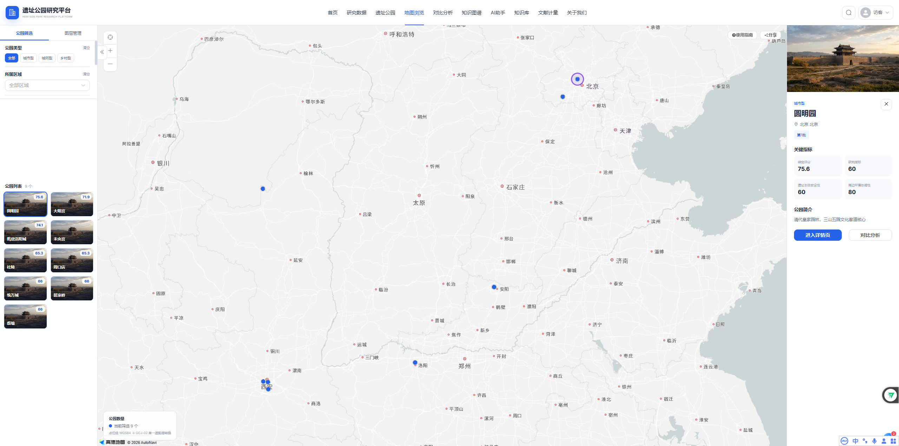
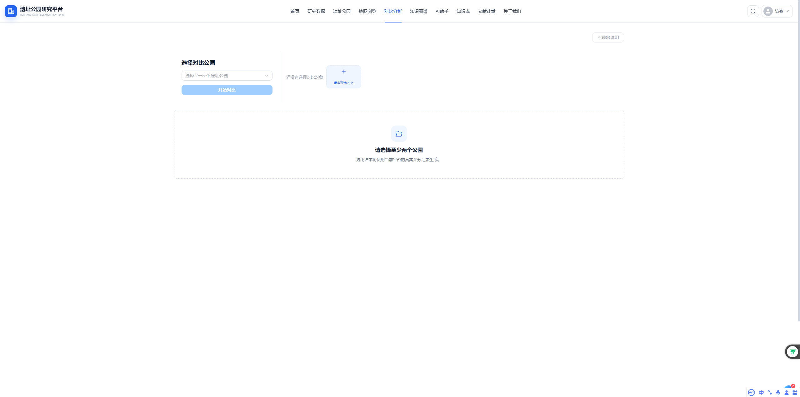
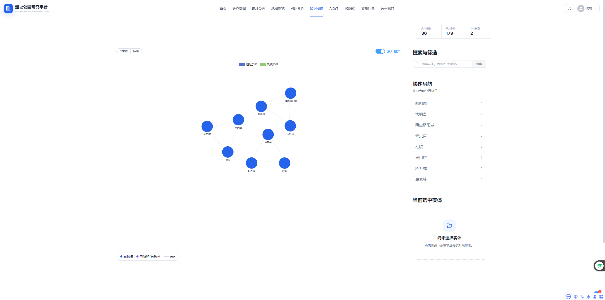
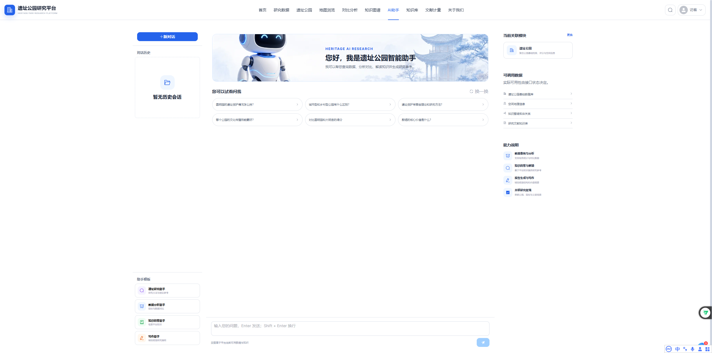
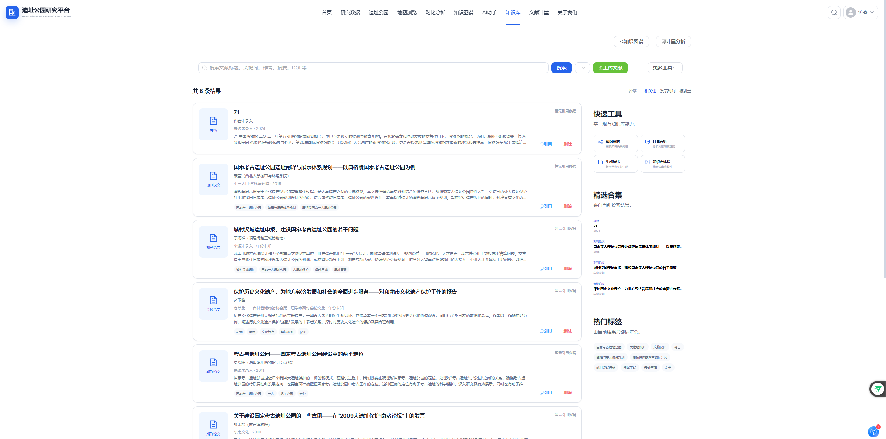
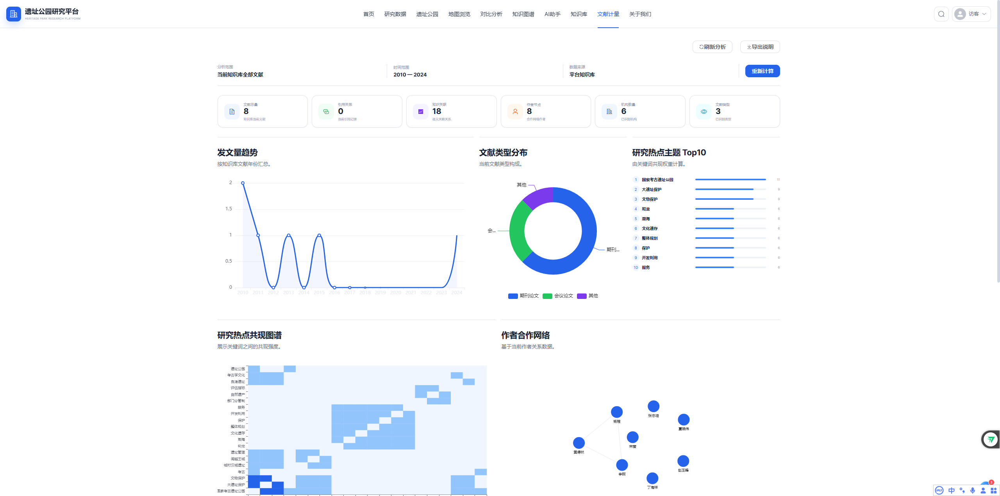

# 考古遗址公园文化价值智能数字化阐释平台操作手册

## 一、相关文档

| 文档名称 | 指向资料 | 说明 |
| --- | --- | --- |
| 总体设计 | 《总体设计》 | 说明软件整体功能、页面组成、运行环境和业务边界。 |
| 详细设计 | 《详细设计》 | 说明各功能页面、输入输出、状态变化和处理规则。 |
| 测试案例 | 《测试案例》 | 记录主要功能的操作场景、预期结果和异常提示。 |

## 二、说明

考古遗址公园文化价值智能数字化阐释平台 V1.0 面向文化遗产保护、考古遗址公园研究、文博管理和数字人文工作。平台把遗址公园档案、评价数据、地理位置、调研报告和专业文献放在统一的门户中，用户可据此开展浏览、检索、比较、关系探索和资料维护。

研究人员和高校师生可使用统计、地图、对比、图谱、知识库与智能助手查找研究线索；文博管理机构和遗址公园工作人员可核对单园档案与评价结果；数据管理员负责补录公园、遗址点、评分和报告解析结果。所有页面均以当前数据库或知识库中的记录为准，资料尚未录入时显示空状态。

面向考古遗址公园研究、保护管理与文化价值阐释的数字研究门户。平台将公园档案、评价指标、空间位置、调研资料和专业文献组织为可检索、可比较、可关联、可问答的研究数据，并通过统计图表、专题地图、知识图谱和智能助手呈现。

介绍公园档案、评价指标、空间位置、文献和智能问答之间的关系。

说明平台显示的是当前数据库和知识库中的真实记录，缺少数据时显示空状态。

普通用户通过浏览器访问，管理员功能取决于账号权限和部署时的鉴权配置。

地图需要配置高德 JavaScript API Key，知识图谱和外部智能服务可按部署条件启用。

本手册用于说明软件的用途、功能特点、运行要求和页面操作流程。各功能章节按用户能够看到的页面、入口、按钮、输入项、提示信息和处理结果进行说明。



## 三、功能特点

门户首页展示平台定位、当前收录数量、研究工具和公园精选内容。用户可从首页直接进入研究数据、公园详情、地图、知识图谱、知识库或智能助手；统计数字由后端接口返回，不使用虚构数量填充。

研究数据总览按数量、类型、区域和评价维度汇总现有样本。统计卡片、评价维度图、公园类型分布图和省级区域分布图用于观察总体结构；接口不可用时，页面显示加载失败并提供重新加载入口。

遗址公园页面支持按类型、省份、批次和关键词组合检索。结果区显示符合条件的公园数量、档案摘要和已录入评分，用户可进入详情或把公园带入对比页面；查询失败时，页面保留当前条件并给出重试提示。

遗址公园详情把名称、类型、地区、批次、简介、评分明细和遗址点放在同一页面。评价雷达图用于观察各维度表现，地图和对比入口会携带当前公园标识，便于继续查看空间位置或进行跨园比较。

地图浏览以真实经纬度显示公园点位，并提供类型、区域、批次和最低分筛选。选中点位后，右侧详情面板显示公园位置、批次、评分和简介；分享按钮复制包含当前状态的页面地址。

对比分析允许选择二至五个公园，按评价维度和具体指标展示差异。结果包括雷达图、柱状图和数据表格，均由已录入评分计算；数据不足或接口异常时，页面显示对应提示而不补造结果。

知识图谱用节点表示公园、指标、区域和批次等实体，用连线表示它们之间的关系。用户可通过搜索或快速导航定位实体，点击节点查看邻居关系，并使用标签和展开模式调整图谱阅读范围。

智能助手接受自然语言问题，可处理公园列表、统计、比较和知识解读请求。回答区可同时显示来源线索或图表；未配置外部模型时，系统仍可使用本地规则和数据库返回可核查的结果。

## 四、系统要求

| 系统要求 | 最低配置 | 推荐配置 |
| --- | --- | --- |
| 操作系统 | 可运行现代浏览器的 Windows 10、macOS 11 或主流 Linux 桌面环境 | Windows 11 或当前受支持的 macOS、Linux 版本 |
| 浏览器或客户端 | 支持 ECMAScript 2020 的 Chrome、Edge、Firefox 或 Safari | 最新版 Chrome 或 Microsoft Edge，分辨率 1366×768 及以上 |
| 网络与服务 | 能够访问已部署的界面和系统服务 API | 稳定网络；地图功能另需有效的高德 JavaScript API Key |

请确保实际运行环境满足以上要求，以保证考古遗址公园文化价值智能数字化阐释平台能够正常打开页面、提交操作和展示处理结果。若部署方式、客户端形态或服务器环境与本表不同，应以实际确认的申请表环境字段为准。

## 五、门户首页

门户首页页面集中展示平台定位、真实统计、研究工具、知识内容和遗址公园入口。用户可以通过浏览器访问平台根地址或点击顶部导航“首页”。

用户首次进入平台时了解当前收录数据和可开展的研究任务，并选择后续页面。

用户在门户首页页面会看到平台主题区和研究入口、公园、指标等统计数字、研究工具卡片、遗址公园精选内容和“查看研究数据”等操作按钮等信息，并可依据页面显示继续处理。

使用该功能时，用户先查看首页统计和平台说明，确认当前数据范围，随后点击研究工具或公园卡片进入对应页面，最后需要总体分析时点击“查看研究数据”。

统计接口不可用时，首页显示加载失败状态；没有公园记录时显示“暂无遗址公园数据”。点击功能卡片或操作按钮后，页面进入对应研究模块，首页数字会在重新读取接口后更新。


## 六、研究数据总览

从顶部导航点击“研究数据”，即可进入数据总览。该页用于从数量、类型、区域和评价维度观察当前样本的总体态势。

研究人员开展样本概览、类型分布和评价维度初步研判时使用。

该部分提供总览统计卡片、评价维度概览图、公园类型分布图、省级区域分布图、数据洞察和快速入口和数据更新说明等页面内容，用户可据此查看状态、填写信息或选择下一步操作。

在该页面中，用户先等待页面读取总览、维度和分布数据，随后将鼠标移至图表数据项查看对应数值，最后根据洞察内容进入公园档案、地图或对比页面继续研究。

评价得分图表以 100 分为上限。当前接口未提供独立更新时间时，更新说明区明确显示“暂无可展示的更新日志”；数据读取失败时，页面显示错误原因和“重新加载”按钮。




## 七、遗址公园检索

点击顶部导航“遗址公园”进入检索页。该页用于按地区、建设类型、评定批次或名称定位目标公园，并衔接详情查看和对比分析。

用户按地域、建设类型、评定批次或名称定位目标公园时使用。

页面上主要呈现类型、省份和批次下拉框、关键词搜索框、查询和重置按钮、推荐公园、卡片或列表视图和查看详情和加入对比按钮等内容，这些内容用于帮助用户确认当前位置和可执行操作。

实际操作时，用户先选择类型、省份或批次，必要时输入公园名称或地点关键词，随后点击“查询公园”查看结果，可切换卡片或列表显示并调整排序，最后点击“查看详情”进入单园档案，或点击“加入对比”进入对比分析。

关键词可以留空，清除全部条件后可恢复全部记录。没有匹配项时，页面显示空状态并提供“清空筛选”；“新增遗址公园”仅对管理员显示。查询成功后结果区更新数量、档案摘要和评分，查询失败则显示重试入口。




## 八、遗址公园详情

用户可从公园列表、地图详情或首页精选内容进入单园详情。该页集中展示基本档案、评价得分、遗址点和相关研究入口。

用户已确定研究对象，需要核对其空间位置、建设信息和文化价值评价表现时使用。

用户在遗址公园详情页面会看到公园名称、类型、地区和批次、公园简介与基础档案、评价维度雷达图和评分明细、遗址点信息和地图和对比分析相关入口等信息，并可依据页面显示继续处理。

使用该功能时，用户先核对公园基础信息和简介，随后查看评分明细及各评价维度雷达图，最后根据研究需要进入地图定位或对比分析。

公园标识无效时，系统提示“遗址公园不存在”；没有评分或遗址点记录时，相应区域显示空状态。点击地图或对比入口后，目标页面自动使用当前公园作为研究对象。


【截图预留：请插入遗址公园详情和评价雷达图截图。】

## 九、地图浏览

用户可从顶部导航“地图浏览”进入专题地图，也可从公园详情跳转。地图用于观察公园空间分布，并联动查看选中公园的摘要信息。

用户需要从地域分布出发筛选和定位公园，或分享带筛选条件的地图视图时使用。

该部分提供公园类型、区域、批次和最低分筛选、地图画布和点位、缩放、重置、筛选面板和使用指南、公园详情面板和分享按钮等页面内容，用户可据此查看状态、填写信息或选择下一步操作。

在该页面中，用户先设置筛选条件并点击“筛选公园”，随后在地图中选择公园点位，查看位置、批次、评分和简介，最后从详情面板进入公园详情或对比分析，必要时复制分享链接。

地图只读取数据库中的有效经纬度，不生成随机点位。未配置高德 Key 时，页面显示“地图服务暂不可用”；移动端需在筛选抽屉中点击“应用筛选”。分享成功时提示“分享链接已复制”，复制失败时可直接使用浏览器地址栏。




## 十、对比分析

通过顶部导航“对比分析”可直接打开比较页面；从公园列表、详情或地图进入时，页面会保留已选择的公园。该功能用于比较不同公园的文化价值评价维度和指标表现。

研究人员进行案例比较、类型差异观察或保护利用水平评估时使用。

页面上主要呈现公园多选框、已选公园卡片、开始对比按钮、维度对比、指标对比和数据表格标签页和雷达图、柱状图和对比洞察等内容，这些内容用于帮助用户确认当前位置和可执行操作。

实际操作时，用户先选择二至五个遗址公园，随后点击“开始对比”加载各公园真实评分，最后切换维度、指标和表格标签页，查看差异和计算结果。

至少选择两个公园后“开始对比”按钮才可用，一次最多选择五个，图表按满分 100 展示。计算完成后可查看维度雷达图、核心维度柱状图、全部指标图和结果表格；加载失败时可点击重新加载。




## 十一、知识图谱

点击顶部导航“知识图谱”进入关系浏览页面。图谱用实体节点和关系边呈现公园、指标、区域、批次等知识关联。

用户需要从关系视角发现公园与评价要素之间的联系时使用。

用户在知识图谱页面会看到图谱画布、重置、标签和展开模式控制、实体搜索框、公园快速导航、当前选中实体和关系信息和图例等信息，并可依据页面显示继续处理。

使用该功能时，用户先在搜索框输入公园或指标名称并执行搜索，或从快速导航选择公园，随后点击图谱节点查看选中实体及其邻居关系，最后使用重置、标签和展开模式调整图谱阅读方式。

未找到实体时，搜索区显示空结果。Neo4j 未启用时，系统使用关系数据库提供基础实体和关系统计；加载成功后图谱高亮或展开所选节点，加载失败则显示重试操作。




## 十二、智能助手

点击顶部导航“AI助手”进入会话页面。用户可用自然语言查询公园数据、开展比较统计或获取知识解读参考。

用户不确定查询入口，或希望用问题表达研究需求并获得带来源线索的回答时使用。

该部分提供历史会话和新对话按钮、推荐问题、消息区、问题输入框和发送按钮、停止生成按钮和可调用数据和能力说明等页面内容，用户可据此查看状态、填写信息或选择下一步操作。

在该页面中，用户先选择推荐问题或在输入框中输入问题，随后按 Enter 或点击发送按钮提交；需要换行时使用 Shift+Enter，最后阅读回答、来源线索和可能返回的图表；需要时切换或删除历史会话。

空白问题不能发送；回答生成期间可点击停止按钮中止输出。回答以平台当前可用数据为依据，外部智能服务未配置时返回本地规则式结果。消息区可显示来源或图表，会话加载、删除或回答失败时给出明确提示。




## 十三、文献知识库

点击顶部导航“知识库”进入文献检索页。用户可查看文献元数据、摘要、引用和知识关联；具有权限的用户还可上传或删除文献。

研究人员查找论据、复制规范引文或探索文献关系；有权限用户可上传和维护文献。

页面上主要呈现关键词搜索和文献类型筛选、文献列表、作者、来源、摘要和关键词、文献详情对话框、GB/T 7714、APA、MLA 引用格式、知识图谱、计量分析、生成综述和知识库体检工具和上传文献按钮等内容，这些内容用于帮助用户确认当前位置和可执行操作。

实际操作时，用户先输入关键词或选择文献类型，执行搜索，随后点击文献卡片查看作者、摘要、核心论点和知识关联，接着选择引用格式并复制引文，或进入图谱、计量、综述和体检工具，最后有权限时选择文献文件上传并等待解析入库。

文献上传支持 PDF、DOCX、DOC、TXT 和 MD，一次只能选择一个文件；生成综述需要配置可用的 AI API Key。搜索结果显示实际检索模式和匹配文献，上传成功后显示入库标题，引用复制、删除、重建索引和体检操作均返回处理结果。




## 十四、文献计量

用户可从顶部导航“文献计量”或知识库的快速工具进入分析页，依据当前入库文献观察研究趋势、热点、作者合作、机构和引用情况。

用户开展文献综述、研究热点识别或学术脉络观察时使用。

用户在文献计量页面会看到分析范围、时间范围和数据来源、发文量趋势和文献类型分布、关键词排名与共现图谱、作者合作网络和机构发文量和高被引文献和研究洞察等信息，并可依据页面显示继续处理。

使用该功能时，用户先确认分析范围为当前知识库全部文献，随后点击刷新或重新计算，最后查看趋势、关键词、作者、机构和被引结果。

没有可分析文献时，页面显示空状态。当前版本尚未提供计量报告导出接口，点击“导出说明”只显示功能提示；重新计算成功后更新图表和排行，失败时可重新加载。




## 十五、登录与权限

启用鉴权的部署环境通过登录页验证用户身份，并区分普通访问和管理员操作权限。访问受保护页面时，未登录用户会被引导至登录页；当前项目关闭鉴权时，登录页显示可直接进入门户的提示。

用户需要进入受保护功能或管理员需要维护数据时使用。

该部分提供用户名输入框、密码输入框和显示密码控制、登录按钮和鉴权关闭时的环境提示和进入门户按钮等页面内容，用户可据此查看状态、填写信息或选择下一步操作。

在该页面中，用户先输入用户名和密码，随后点击“登录”或按 Enter 提交，最后登录成功后进入原目标页面或门户首页。

启用鉴权时，用户名和密码均为必填项；账号不存在、密码错误或账号被禁用时，页面显示对应错误。验证成功后系统提示“登录成功”并返回原目标页面；AUTH_ENABLED=false 时用户可直接进入门户。


【截图预留：请插入登录页或鉴权关闭提示截图。】

## 十六、数据管理与报告导入

管理员从用户菜单进入“数据管理”，在同一页面维护遗址公园、遗址点、评分、用户和调研报告解析结果。普通账号没有管理权限时会看到禁止访问提示。

平台管理员补录、修订、批量导入或删除业务数据，以及调整用户角色和状态时使用。

页面上主要呈现遗址公园、遗址点、评估评分、用户管理和报告导入标签页、新增、编辑、删除和 Excel 导入按钮、公园与评分编辑表单、报告文件上传区、公园、评分和问卷解析结果预览和确认导入按钮等内容，这些内容用于帮助用户确认当前位置和可执行操作。

实际操作时，用户先选择需要维护的数据标签页，随后新增或编辑记录时填写表单并保存；删除前核对确认提示，接着批量导入时选择 Excel 文件并查看导入结果，之后报告导入时上传一个 DOCX、DOC 或 TXT 文件，查看解析预览，移除不正确条目后确认入库，最后在用户管理中选择角色或切换账号状态。

公园名称、类型、省份和城市为必填项；新增评分时必须选择公园、指标和得分。Excel 导入仅接受 XLSX、XLS，报告导入接受 DOCX、DOC、TXT 且一次一个文件。删除公园前系统提示关联数据将一并删除；保存、删除和导入完成后，页面分别显示处理结果以及成功、失败条目数量。


【截图预留：请插入数据管理标签页、编辑表单及报告解析预览截图。】

## 十七、典型使用流程

用户完成一次完整业务时，通常先进入考古遗址公园文化价值智能数字化阐释平台，再选择或创建业务对象，随后按照页面提示处理内容并查看结果。

用户从门户首页了解平台收录范围和研究入口；用户进入研究数据、遗址公园或地图页面定位研究对象；用户打开公园详情核对基础档案、遗址点和评价得分；用户将关注的二至五个公园加入对比，查看维度、指标、图表和表格差异。

## 十八、常见问题解答

问题：地图为什么提示服务暂不可用？
解决方法：部署环境未配置 VITE_AMAP_JS_KEY 或地图服务加载失败。请联系管理员补充合法 Key 后刷新页面，平台不会用假地图替代。

问题：为什么某些公园没有遗址点、简介或评分？
解决方法：页面只显示当前数据库已录入内容。空状态表示对应记录尚未导入，可由管理员在数据管理中补充。

问题：为什么知识图谱结果较少？
解决方法：请确认图谱已由构建脚本生成并启用 Neo4j；未启用时系统只能基于关系数据库返回基础结果。

问题：智能助手为什么返回规则式答案？
解决方法：当前部署可能未配置外部大智能服务。系统仍可基于本地数据库完成列表、统计和部分比较问题。

问题：生成文献综述为什么失败？
解决方法：该功能需要已入库文献和有效的 AI API Key。请先检查知识库内容及系统服务智能服务配置。

问题：无法进入数据管理页面怎么办？
解决方法：数据管理要求管理员权限。请使用管理员账号登录，或联系平台管理员核对账号角色和鉴权配置。

## 十九、术语表

| 术语 | 解释 |
| --- | --- |
| 考古遗址公园 | 以重要考古遗址及其环境为核心，兼具保护、研究、展示、教育和公共服务功能的特定空间。 |
| 评价维度 | 将多项评价指标按保护管理、科研价值、展示利用或公共服务等主题汇总形成的分析类别。 |
| 知识图谱 | 用节点表示公园、遗址点、指标、区域等实体，用连线表示实体之间关系的知识组织方式。 |
| 文献计量 | 利用年份、关键词、作者、机构和引用等文献元数据进行统计分析的方法。 |
| RAG | 在生成回答前先从平台数据库或知识库检索相关内容，并将检索结果作为回答依据的处理方式。 |
| 文化价值数字化阐释 | 通过档案、指标、空间、关系、文献和问答等数字形式组织并说明考古遗址公园价值信息。 |

```text
STOP_FOR_USER
NEXT_ACTION: 请一次性确认完整操作手册草稿是否符合真实业务；必要时先统一修改段落内容，再运行 confirm_stage.py --stage markdown。
```
